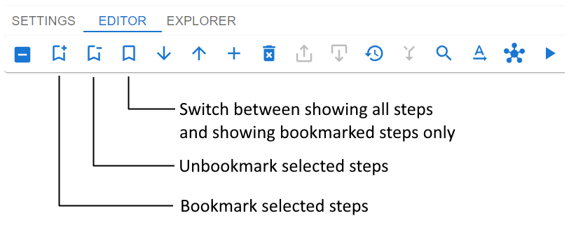
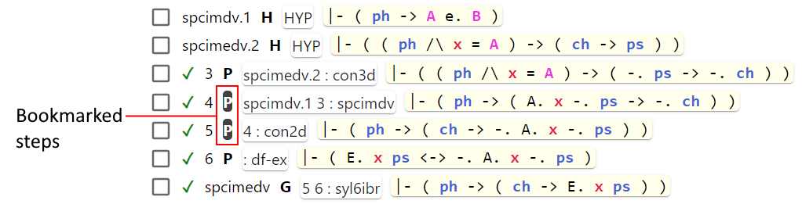

# Bookmark steps

When working with a long proof it may become difficult to navigate between the steps of the proof.
Usually, only a few steps are of interest, and all other steps may be hidden.
Bookmarking allows to control what steps to show and what to hide.

The screenshot below shows three buttons used for bookmarking.

In order to bookmark/unbookmark steps:
1. select steps you want to bookmark/unbookmark (see below how to conveniently select a range of steps)
2. click the corresponding button (the one with `+` sign to bookmark, the one with `-` sign to unbookmark)

Bookmarked steps look a bit different, as shown on the screenshot below.

When some steps are bookmarked you can click the third button (the one without any sign) 
to switch between showing bookmarked steps only and showing all steps.

Hypothesis steps and the goal step will always be displayed as if they were permanently bookmarked.

Bookmarked steps will not be deleted by the [Delete unrelated steps](delete_unrelated_steps.md) feature.

If you need to select multiple consecutive steps, it is not necessary to click them one by one.
You can select the first one and then, while holding down the Shift key, select the last one.
As a result, all the steps located between the first and last will also be selected.