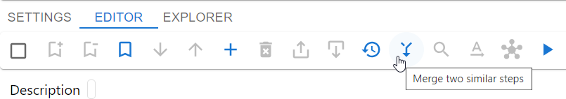
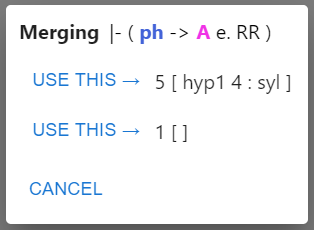

# Merge similar steps

Metamath-lamp doesn't allow two or more steps to have the same statement.
However, it happens frequently enough that two steps with identical statements appear in the editor.
To resolve this situation you can use the "Merge two similar steps" feature.
You don't need to select any steps in the editor.
Just click the "Merge two similar steps" icon button.

Metamath-lamp will identify steps to merge and open a dialog.

This dialog shows the statement which is identical in both steps.
Also, it shows labels and justifications for each step.
Labels and justifications are shown in the same order as they appear in the editor.
You need to decide which step to use and click the "USE THIS" button for it.
In the majority of cases, one of justifications will be empty.
So, you can click the "USE THIS" button for the other non-empty justification.

For such trivial cases when one of the justifications is empty, 
Metamath-lamp can automatically select the step with non-empty justification.
To enable this feature, set "Automatically merge similar steps" on the Settings tab.
However, the auto merging feature may lead to confusing situations sometimes,
because it works without any notice.
That's why it is Off by default.
Just keep this in mind when you are confused by behaviour of the Editor, 
and check if the auto merge could be the reason.

Sometimes, merging similar steps results in wrong order of steps.
For example, step 2 depends on step 1, but step 1 is located after step 2.
This may happen if during the merge you selected the lower step.
This type of inconsistency can be fixed with 
[reorder steps automatically](reorder_steps_automatically.md).