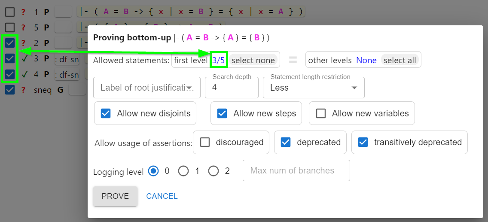

# Steps to use in the Bottom-Up prover

If you select multiple steps before clicking the "Unify" button in the editor,
then all selected steps but the last one will be placed into the "Allowed statements: first level"
of the bottom-up prover dialog. 
This essentially tells the prover "prove the last selected step using other selected steps".

