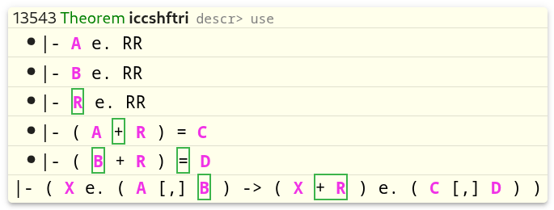
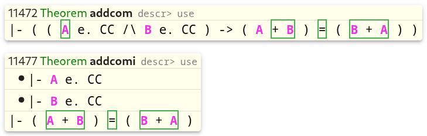

# Search by pattern (version 2)

### What a pattern is

For each frame, the search engine creates a sequence of math symbols
by concatenating all essential hypotheses (in the order of definition) and the assertion statement.
A pattern defines a sequence of math symbols which needs to be found within a frame's sequence.
If the pattern sequence of symbols is a subsequence of a frame's sequence, then the frame matches the pattern.

### The syntax of patterns

#### The simplest pattern

A non-empty space separated sequence of math symbols is a valid pattern.

Each constant in the pattern matches the same constant in a frame.
If a constant is a typecode, then it matches any variable of this type.

A variable in the pattern matches a variable of the same type in a frame 
(but not necessarily of the same name).

If the same variable is present two or more times in a pattern, 
each such occurrence will match the same variable in a frame. 
For example, if the first occurrence of the variable `A` in a pattern matched `K` in a frame,
then the second occurrence of `A` in the pattern will also match `K` in the frame.

Two different variables in a pattern will match two different variables in a frame.
For example, if a pattern is `A = B`, and `A` matched `K` in a frame, then `B` cannot match `K`. 
In that case, `B` must match another variable in the frame.

#### Adjacent and non-adjacent symbols

If a pattern is just a space separated sequence of math symbols,
then, when matching against a frame, arbitrary number of frame's symbols may appear
between pattern's symbols. 
For example, `A + B + C` will match `( A + ( B + C ) )`;
`ph -> ps` will match `( ph -> A. x ps )`.

To disallow intervening symbols, surround the pattern symbols with square brackets and a plus sign `+`.
For example, `$[+ ph -> ps $]` will no longer match `( ph -> A. x ps )`.

All the control symbols (like square brackets in the previous example `$[` and `$]`) within a pattern
should begin with the dollar sign `$`, because this is the only symbol which cannot occur in math symbols.
Square brackets is the only type of brackets which can be used in patterns.

The plus sign `+` immediately following the opening bracket `$[` is called a flag.
It instructs the search engine that all the symbols within this pair of brackets must be adjacent, 
unless cancelled by a minus sign `-`. The usage of `-` to cancel `+` will be explained later.

#### The scope of the pattern symbols

When you don't know well enough the syntax of a particular Metamath database,
you will tend to use non-adjacent symbols in patterns. 
But this may lead to the problem that all pattern symbols are scattered around a frame,
which leads to less useful search results. 
For example, when trying to find the commutativity law using the pattern `A + B = B + A`,
you may get this result:

This happens because the pattern gets matched against the concatenation of all hypotheses and assertion.

To get more useful results, you may specify in which part of a frame the pattern symbols must occur. 
For example, for the `A + B = B + A` case you can surround these symbols with square brackets and use the `a` flag,
which would mean that all symbols within this pair of brackets must occur in the assertion statement of a frame.
So, the pattern `$[a A + B = B + A $]` will decrease the number of search results, 
and the remaining results will be more useful, for example:

These are all available flags which define the scope:
- 'h' - any hypothesis statement.
- 'H' - concatenation of all hypothesis statements (in the order of definition).
- 'a' - the assertion statement.
- 's' - any single statement (a hypothesis or assertion).

You can combine multiple flags which don't contradict each other.
For example, `$[+a ph -> ps $]` will find all frames which have adjacent symbols `ph -> ps` in its assertion.
But if you want to find `$[+ ph -> ps]` in either a hypothesis or assertion 
and specify the pattern `$[+ha ph -> ps $]` then this would be wrong.
For the search engine, `$[+ha ph -> ps $]` means that `$[+ ph -> ps]` 
must occur in a hypothesis and in the assertion at the same time,
which is impossible. Instead, you can use the `s` flag `$[+s ph -> ps $]`.

`Hs` is equivalent to just `h`.

The order of flags doesn't matter. So, `$[+s ph -> ps $]` is the same as `$[s+ ph -> ps $]`.

