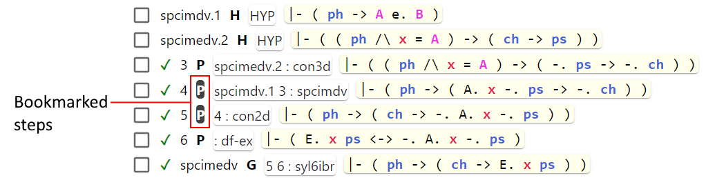

# Bookmark steps

When working with a long proof it may become difficult to navigate between the steps of the proof.
Usually, only a few steps are of interest, and all other steps may be hidden.
Bookmarking allows to control what steps to show and what to hide.

The screenshot below shows three buttons used for bookmarking.

In order to bookmark/unbookmark steps:
1. select steps you want to bookmark/unbookmark (see below how to conveniently select a range of steps)
2. click the corresponding button (the one with `+` sign to bookmark, the one with `-` sign to unbookmark)

Bookmarked steps look a bit different, as shown on the screenshot below.

When some steps are bookmarked you can click the third button (the one without any sign) 
to switch between showing bookmarked steps only and showing all steps.

Hypothesis steps and the goal step will always be displayed as if they were permanently bookmarked.

If you need to select multiple consecutive steps, it is not necessary to click them one by one.
You can select the first one and then, while holding down the Shift key, select the last one.
As a result, all the steps located between the first and last will also be selected.

Bookmarked steps will not be deleted by the [Delete unrelated steps](delete_unrelated_steps.md) feature.

There is a slight difference in manual reordering of steps 
in the "Show all steps" and "Show only bookmarked steps" modes.
In the "Show all steps" there are no any restrictions in how you can move selected steps.
For example, if you have two steps 1 and 2, and step 2 depends on step 1, 
you still can move step 2 to the top, thus placing it above step 1.
But in the "Show only bookmarked steps" mode, the editor will not allow you to make such moves.
For example, you have 4 steps 1, 2, 3, and 4. Steps 2, 3 and 4 are bookmarked. 
Since you are in the "Show only bookmarked steps" mode, only 3 steps are shown (2, 3, and 4).
Let's say step 4 depends on step 3. In that situation, if you select step 4 and try to move it up,
this step will not be moved. 
This restriction is implemented intentionally. 
In the "Show only bookmarked steps" mode, there are usually many hidden steps.
If not that restriction, then manual reordering could lead to wrong order of steps 
which would be hard to recover.
In that example, if you still want to move step 4 up, you need to also select step 3.
If steps 3 and 4 don't depend on step 2, then both steps 3 and 4 will be moved up.
As a result, steps 3 and 4 will be placed above step 2. 
As a general rule, if a bookmarked step is not moving, 
select the next step in the direction of the movement and try to move them together. 
Keep selecting one next step until the selected group of steps starts moving.