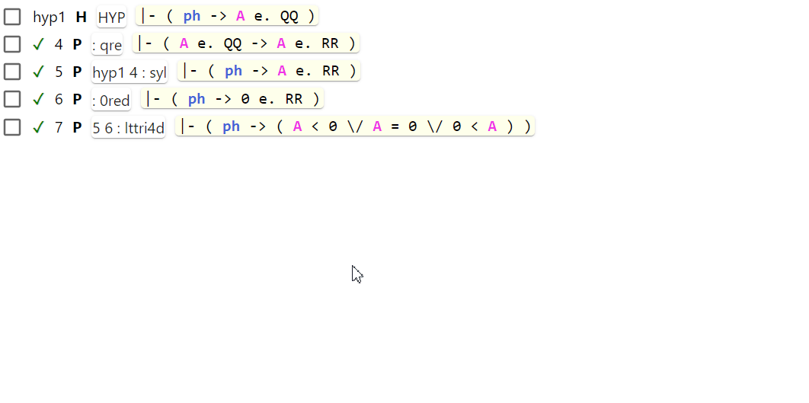

# Transform: Copy: X ⇒ ( ph -> X )

The "Copy: X ⇒ ( ph -> X )" transform is intended to be used in deduction proofs.
It will copy the selected fragment of a step as a new step prepending it with `ph ->`.

This transform is similar to the usual fragment copying, 
but it will prepend the fragment with `ph ->`.
See the difference on the short animation below. 
(The animation has been recorded for an older version of metamath-lamp 
where this transform was named "Extract: X ⇒ ( ph -> X )")

