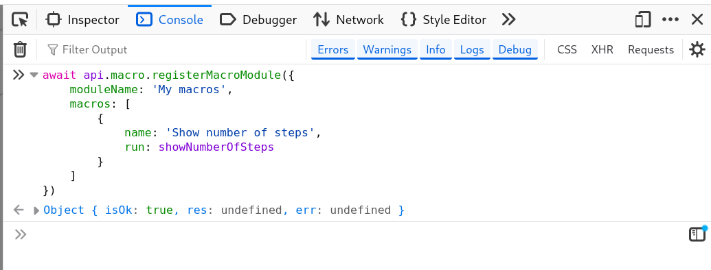
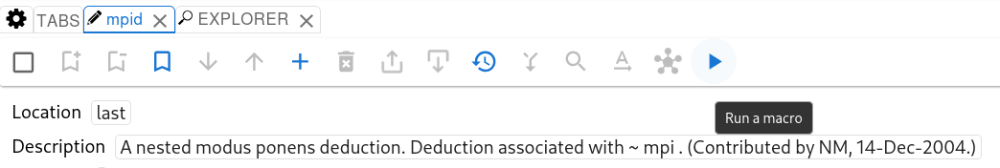
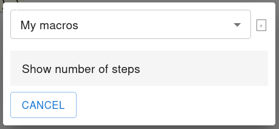
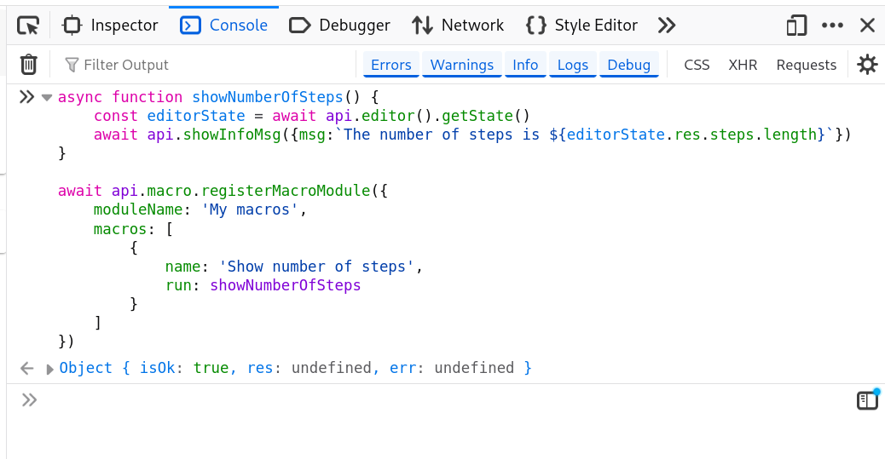
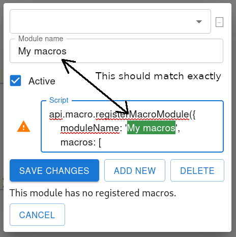

### What is a macro in metamath-lamp

A macro is a sequence of actions which automate some repetitive interactions with the user interface 
or just arbitrary computations.
For example, you can implement a macro which will analyze current editor state 
and modify it depending on different conditions.

Macros are written in JavaScript. Mm-lamp uses the ability of a web-browser to run arbitrary JavaScript code.
Also, mm-lamp has some predefined JavaScript functions which allow to interract with the mm-lamp internal state.
Such predefined JavaScript functions are called API functions in this documentation.
A list of all currently available API functions can be found [here](available_api_functions.md).

This document will guide you through a process of creating a simple macro which will be invoked by clicking
a button in the mm-lamp UI.
This macro will show the number of statements currently loaded in the editor.

### Running arbitrary JavaScript code in a web browser

Before creating a macro let's see how we can run arbitrary JavaScript code in a web browser.
Many contemporary web browsers allow access to a console where you can run JavaScript code.
Usually you can open such console on any tab using a menu. 
For exampe, this is how you can open it in Firefox:


You can run arbitrary JavaScript code in this console.

The screenshot below shows a simple expression, variable definition, function definition, and function invocation.


### Using mm-lamp API functions

Mm-lamp defines a global variable `api`.
Using this global variable you can access API functions exposed by mm-lamp.
All API functions return 
a [Promise](https://developer.mozilla.org/en-US/docs/Web/JavaScript/Reference/Global_Objects/Promise) object.
That means you need to prepend an API function invocation with the `await` keyword in the code if you want to get 
the result of the function execution.

In the example macro we will need to get the editor state (from which we will get the number of steps).
We can get the editor state by executing the `api.editor().getState()` API function directly in the console 
opened on the tab where mm-lamp application is loaded.


Usually API functions can be accessed as `api.someProperty.apiFunction(arguments)`.
But for editor we need to write `api.editor().apiFunction(arguments)`.
The reason is that `api.editor` is a function which can accept an editor id.
If you don't specify an editor id, the last opened editor will be used.

To show a message we can use the `api.showInfoMsg()` function:


This will open a small modal window:


### Combining several API functions

Let's combine `api.editor().getState()` and `api.showInfoMsg()` to show the number of steps in the editor.
We can define a custom function in the console. 
Notice the function is prepended with the `async` keyword.
It is needed because the function uses `await` keyword inside.
```js
async function showNumberOfSteps() {
    const editorState = await api.editor().getState()
    await api.showInfoMsg({msg:`The number of steps is ${editorState.res.steps.length}`})
}
```


Now you can invoke this function from the console


This will show a message


### Invoking a macro from the UI

The `showNumberOfSteps` function is already a macro.
But we need to open the console and type `await showNumberOfSteps()` each time we want to invoke it.
This is inconvenient.
We can "register" this function in mm-lamp UI, so we will be able to call it by clicking a button on the UI.
We can achieve that using the `api.macro.registerMacroModule()` API function.

```js
await api.macro.registerMacroModule({
    moduleName: 'My macros',
    macros: [
        {
            name: 'Show number of steps',
            run: showNumberOfSteps
        }
    ]
})
```


This code added our macro to the list of macros accessible via the "Run a macro" button (a small triangle) 
available in the toolbar of each editor.
All macros are grouped into modules. A module is just a list of macros.
The above invocation of `api.macro.registerMacroModule()` has registered a module named `My macros`
which contains one macro named `Show number of steps`.
You can register multiple macros in a module by providing multiple objects of the form `{name:string, run:function}`
in the `macros` input parameter of the `api.macro.registerMacroModule()`.



When you click the "Run a macro", a small modal window opens.
In this window you can select a macro module and then select a specific macro to run.



Now you can just lick the "Show number of steps" to run the macro.

### Persisting macros

Now you can conveniently invoke the macro from the UI.
But if you reload the page with mm-lamp, you'll notice that the macro has disappeared.
This happens because `api.macro.registerMacroModule()` doesn't persist macros.
You will need to open the console and run the below code to add the macro to the UI again.

```js
async function showNumberOfSteps() {
    const editorState = await api.editor().getState()
    await api.showInfoMsg({msg:`The number of steps is ${editorState.res.steps.length}`})
}

await api.macro.registerMacroModule({
    moduleName: 'My macros',
    macros: [
        {
            name: 'Show number of steps',
            run: showNumberOfSteps
        }
    ]
})
```



Except that this is inconvenient, this approach has one significant disadvantage.
When you run code like `async function showNumberOfSteps() { ... }` in the browser console,
it makes the `showNumberOfSteps` a global function.
In other words it places this function to the global namespace.
This way, you can occasionally override some existing global function with the same name
which may break mm-lamp functionality 
(in the worst case, reloading the page with mm-lamp will be enough to remediate).

To persist macros such that they survive page reloads do the following:

1. Click the `Run a macro` button in the editor toolbar (a triangle shaped button).
2. Click the small `+` button to the right of the dropdown with names of macro modules.
3. Click the `Add new` button.
4. Paste you code with macros to the `Script` text area 
(for this example, the definition of the showNumberOfSteps function 
and the invocation of api.macro.registerMacroModule, i.e. the content of the code snippet above).
5. Type exactly the same name of the module in the `Module name` field as it is passed in the `moduleName` 
input parameter of the `api.macro.registerMacroModule`. For this example it should be "My macros".
If the value of `moduleName` attribute and the value in the `Module name` text field mismatch,
nothing critical will happen, but you will be confused by mm-lamp behavior.
6. Make sure the `Active` checkbox is selected.
7. Click the `Save changes` button.
8. Click the small `-` button to the right of the module name dropdown to hide additional UI elements.



Mm-lamp will save the JavaScript code in the local storage of the browser
and will run it each time mm-lamp loads in a browser tab.
That's how macros will survive page reload.
Moreover, mm-lamp wraps the provided code into an unonymous function before executing it for not to create
global functions (all the global functions in the provided script become local functions 
of the anonymose function wrapper, so they don't pollute the global namespace).

The actual code mm-lamp will run on page load is as follows:

```js
const AsyncFunction = Object.getPrototypeOf(async function(){}).constructor;
(new AsyncFunction("... text of the script with macros ..."))();
```

Similarly, you can update the script of existing macros:

1. Click the `Run a macro` button in the editor toolbar (a triangle shaped button).
2. Select the module you want to update in the dropdown with names of macro modules. 
2. Click the small `+` button to the right of the dropdown with names of macro modules.
3. Update the script in the `Script` text area
5. Make sure the value in the `Module name` field still matches the value passed in the `moduleName`
   input parameter of the `api.macro.registerMacroModule`.
7. Click the `Save changes` button.
8. Click the small `-` button to the right of the module name dropdown to hide additional UI elements.