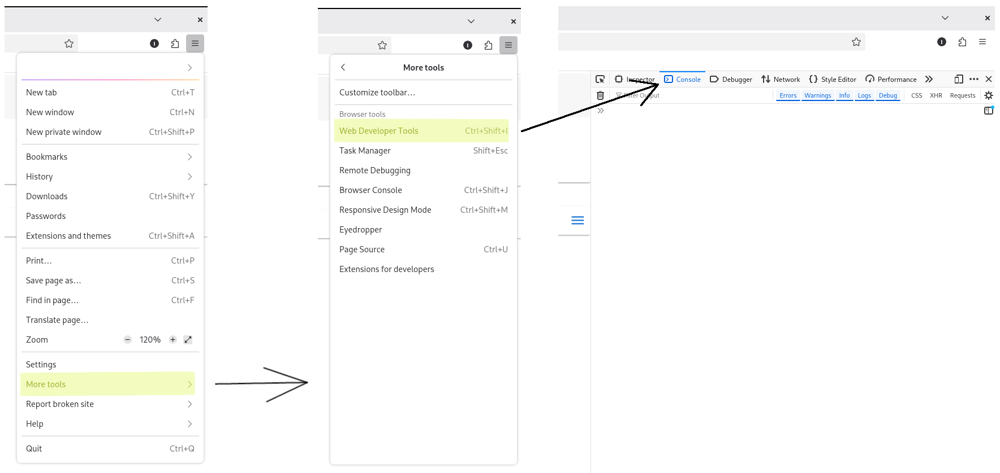
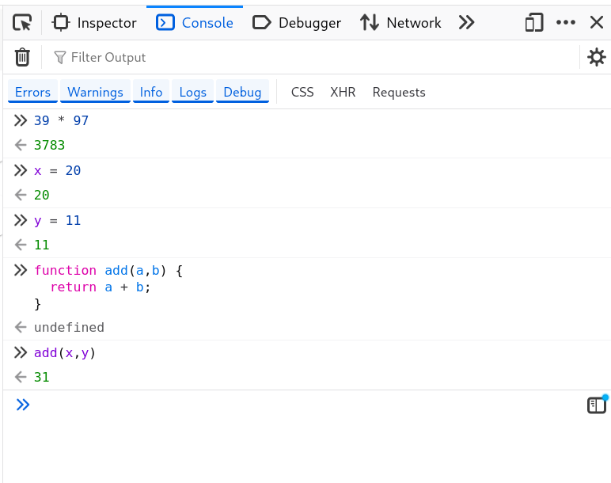
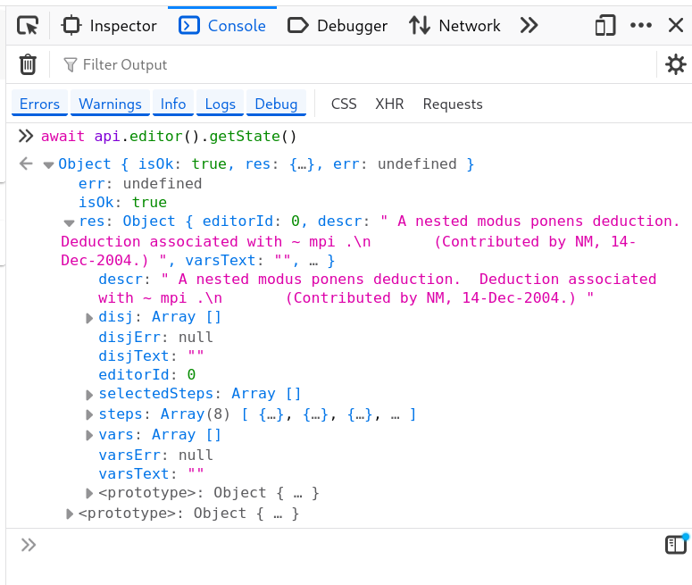
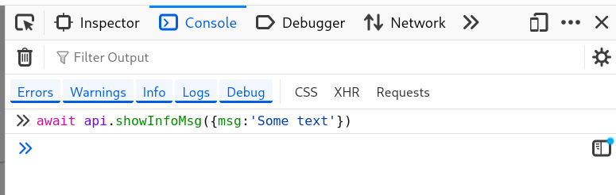
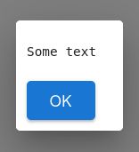
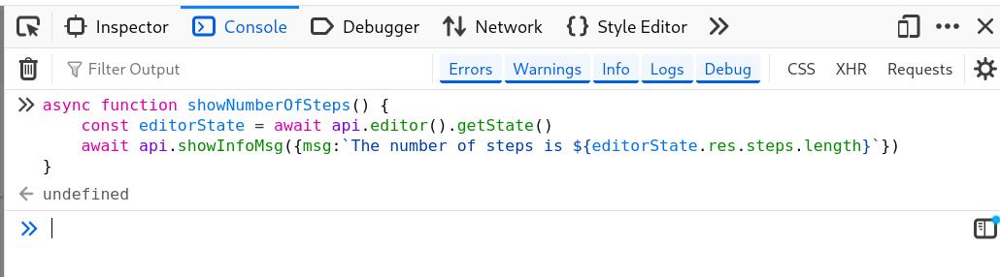
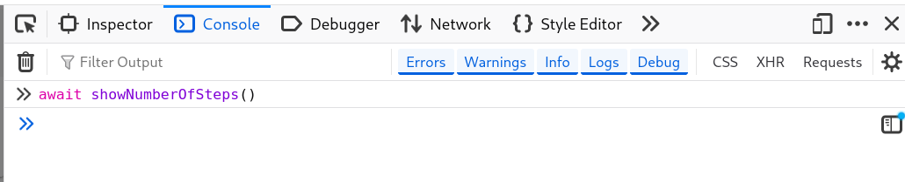
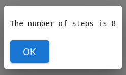

### What is a macro in metamath-lamp

A macro is a sequence of actions which automate some repetitive interactions with the user interface 
or just arbitrary computations.
For example, you can implement a macro which will analyze current editor state 
and modify it depending on different conditions.

Macros are written in JavaScript. Mm-lamp uses the ability of a web-browser to run arbitrary JavaScript code.
Also, mm-lamp has some predefined JavaScript functions which allow to interract with the mm-lamp internal state.
Such predefined JavaScript functions are called API functions in this documentation.
A list of all currently available API functions can be found [here](available_api_functions.md).

This document will guide you through a process of creating a simple macro which will be invoked by clicking
a button in the mm-lamp UI.
This macro will show the number of statements currently loaded in the editor.

### Running arbitrary JavaScript code in a web browser

Before creating a macro let's see how we can run arbitrary JavaScript code in a web browser.
Many contemporary web browsers allow access to a console where you can run JavaScript code.
Usually you can open such console on any tab using a menu. 
For exampe, this is how you can open it in Firefox:



You can run arbitrary JavaScript code in this console.

The screenshot below shows a simple expression, variable definition, function definition, and function invocation.



### Using mm-lamp API functions

Mm-lamp defines a global variable `api`.
Using this global variable you can access API functions exposed by mm-lamp.
All API functions return 
a [Promise](https://developer.mozilla.org/en-US/docs/Web/JavaScript/Reference/Global_Objects/Promise) object.
That means you need to prepend an API function invocation with the `await` keyword in the code if you want to get 
the result of the function execution.

In the example macro we will need to get the editor state (from which we will get the number of steps).
We can get the editor state by executing the `api.editor().getState()` API function directly in the console 
opened on the tab where mm-lamp application is loaded.



Usually API functions can be accessed as `api.someProperty.apiFunction(arguments)`.
But for editor we need to write `api.editor().apiFunction(arguments)`.
The reason is that `api.editor` is a function which can accept an editor id.
If you don't specify an editor id, the last opened editor will be used.

To show a message we can use the `api.showInfoMsg()` function:



This will open a small modal window:



### Combining several API functions

Let's combine `api.editor().getState()` and `api.showInfoMsg()` to show the number of steps in the editor.
We can define a custom function in the console. 
Notice the function is prepended with the `async` keyword.
It is needed because the function uses `await` keyword inside.
```js
async function showNumberOfSteps() {
    const editorState = await api.editor().getState()
    await api.showInfoMsg({msg:`The number of steps is ${editorState.res.steps.length}`})
}
```


Now you can invoke this function from the console



This will show a message

