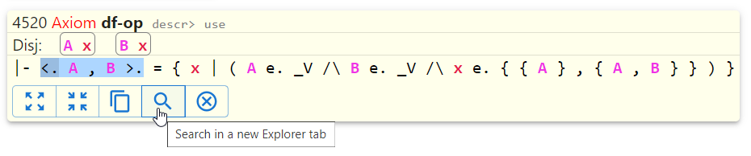

# Opening multiple Explorer tabs

There are two ways of opening a new Explorer tab.

The first way is very straightforward. Just select "Open new Explorer tab" menu item in the "hamburger" menu in any 
opened Explorer tab.

Another way is a bit tricky. First you need to select a fragment of any statement in an Explorer tab 
or in a Proof Explorer tab. The selected fragment will have a button with a magnifying glass icon. 
When you click this button, a new Explorer tab will open. 
Its "search pattern" field will be prepopulated with the content of the selected fragment.

