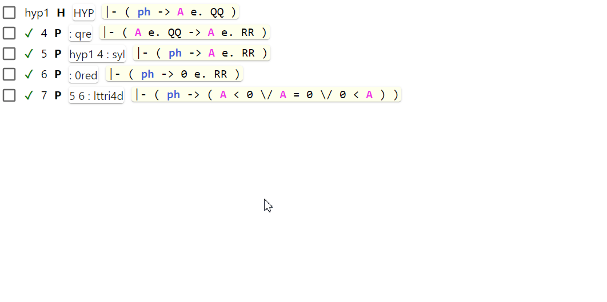

# Transform: Extract: X ⇒ ( ph -> X )

The "Extract: X ⇒ ( ph -> X )" transform is intended to be used in deduction proofs.
It will extract the selected fragment of a step as a new step prepending it with `ph ->`.

This transform is similar to the usual fragment extraction, but it will add `ph ->`.
See the difference on the short video below:

